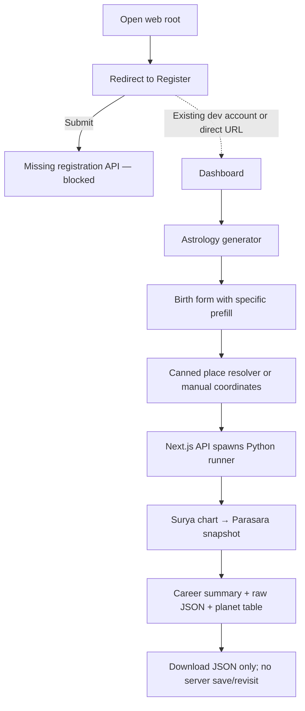

# Parasara MVP — Current State and Plan

Date: 2026-07-17
Repository: `medimanuiai/r7m2x9k4q8`
Inspected product base: PR #1 head `8040255eff6fe56da810b86fac12a9a6d0f1f6c3` (detached, read-only inspection)
Original review scope: Phase 1 analysis only; the completion record below tracks the subsequent bounded implementation

## MVP-01 completion record (2026-08-05)

The bounded MVP-01 implementation described by this planning report is now complete on
`agent/parasara-mvp01` in `medimanuiai/Jyothishyam` and is being published as a draft for
owner review. This delivery:

- makes the account-free Birth-to-Career generator the primary web entry point;
- uses empty inputs plus an explicitly synthetic sample instead of personal prefills;
- accepts manual coordinates and an IANA time zone without fabricating geocoding results;
- converts local birth time to UTC and applies Lahiri ayanamsa before deriving placements;
- exports bounded whole-sign houses consistently to the chart and Career evidence;
- enforces stable validation errors and bounded, sanitized child-process handling;
- presents Lagna, planetary placements, Career evidence, and an optional JSON download;
- keeps internal `Kethu` compatibility while presenting the conventional `Ketu` label in the UI.

Validation for publication covers the focused synthetic chart boundary, existing Career and
snapshot regressions, the full protected-artifact validator under Python 3.11 and 3.14, the
production frontend build, and desktop/mobile visual review. Approved snapshots and protected
contracts remain unchanged.

Intentional MVP-01 limitations remain: Career is the only supported interpretation domain;
place lookup is deferred in favor of honest manual coordinates; results are ephemeral with no
account or server-side persistence; node motion is omitted when unsupported; and broader Yoga,
Dasha, Wealth, relationship, health, transit, Audit25, and mobile-app work remains out of scope.

## Executive conclusion (original pre-implementation assessment)

At the time of the original review, the repository had a strong deterministic Predicate/Rule foundation and a real developer-only path from birth input to a Career snapshot, but it did **not** yet have a trustworthy, coherent web MVP.

The smallest useful MVP should be an **ephemeral Career-focused Parasara experience**:

1. enter birth details and confirm the resolved place/time zone;
2. generate a correctly labelled Lahiri-sidereal chart;
3. see a compact chart overview and the existing Career result;
4. inspect plain-language evidence derived from the existing locked Career contract;
5. optionally download the result locally.

Accounts, server-side saving, multiple life domains, payments, AI chat, transits, and iPhone work should not block this first MVP. The current account code is scaffold-only, so save/revisit is not part of the smallest coherent journey.

## 1. PR and base state

- [PR #1](https://github.com/medimanuiai/r7m2x9k4q8/pull/1) is **open**, **not a draft**, **mergeable**, and not merged.
- Its head still matches the handoff SHA: `8040255eff6fe56da810b86fac12a9a6d0f1f6c3`.
- Both workflows associated with that head completed successfully:
  - [Prompt-01 Stage-01](https://github.com/medimanuiai/r7m2x9k4q8/actions/runs/29607513245): success;
  - [Parasara Snapshot Compare](https://github.com/medimanuiai/r7m2x9k4q8/actions/runs/29607513146): success.
- Because the PR is already non-draft, it does not need to be marked ready. The owner should perform the final human review and merge it. No merge was performed during this review.
- Until it is merged, Phase 1 uses the PR head as the correct base because it contains the completed Prompt-01 contracts that future work must preserve.

## 2. Actual visible user flow

What a user can actually see today:

- The root page redirects to `/register`.
- Registration submits to an API route that is absent from the Next.js app, so the normal first-user journey stops there.
- `/account/astro` is directly reachable because no route protection was found.
- The astrology page collects date, time, place, latitude, longitude, time zone, and consent.
- “Resolve” is not real geocoding: one named test city returns canned data and every other query silently receives the same fallback city coordinates.
- The API starts a Python child process for every request. The runner creates a chart, normalizes it, and assembles a Parasara snapshot.
- The visible result is primarily a Career score summary, a developer-oriented raw JSON toggle/download, and a basic planet table.
- No chart or result is stored. The dashboard, account, and several linked pages/endpoints are placeholders or absent.

## 3. Feature inventory

| Product surface | Source-backed status | MVP treatment |
|---|---|---|
| Birth-details form | Working and visible, but specifically prefilled and weakly validated | Keep; replace with empty fields plus a clearly labelled synthetic sample |
| Direct `/account/astro` page | Working and visible | Make the ephemeral generator the primary MVP entry point |
| Birth input → Python → Parasara request path | Working prototype | Keep the vertical path; harden its contract and Windows execution |
| Basic Surya planet table | Working and visible | Retain as a compact chart overview, not a debugging dump |
| Career summary/score/confidence | Working and visible | Make this the first supported MVP domain |
| Career indicators/evidence | Working in engine output for some fixtures, minimally exposed | Render concise, plain-language evidence while preserving locked values |
| JSON preview/download | Working and visible | Keep download; hide raw JSON behind an advanced/developer action |
| Prompt-01 typed predicates, conditions, registry, cache | Working but not a user-facing feature | Preserve; do not redesign |
| Yoga typed evaluation | Working internally; snapshot assembler returns an empty Yoga list | Keep internal tests; expose only after output wording/rule eligibility is confirmed |
| Vargas, aspects, functional roles, strengths | Partially working internally; mostly not explained in UI | Use only facts already required by the Career slice; defer broad exposure |
| Vimshottari Dasha | Implemented but partial and not wired to primary output | Non-MVP until Moon-longitude and timing concerns are corrected/verified |
| Wealth | Placeholder score/empty summary | Do not display as a real result; return an explicit unavailable state or omit from MVP |
| Marriage, children, health, safety | Missing | Future, not MVP |
| Transits | Empty placeholder | Future, not MVP |
| Top-level explainability policy | Skeletal/empty | Replace the visible experience with selected Career evidence; do not expose raw traces |
| Place resolution | Broken/misleading canned implementation | Replace before accepting real user birth input |
| Local time / chart frame handling | Broken for product claims: tropical positions are labelled Lahiri sidereal without applying ayanamsa | Correct and regression-test before presenting results as Parasara |
| API input validation | Partial: only presence of latitude/longitude is checked at the web boundary | Add strict bounded validation and stable client-safe errors |
| API failure handling | Broken safety boundary: raw child-process details can be returned to clients | Replace with safe error codes/messages; keep details server-side and sanitized |
| Registration/login/account | Partial scaffold; normal registration and profile APIs are missing, auth is not enforced | Defer accounts from MVP; do not imply chart saving exists |
| Save/revisit | Missing | Future after a real account/data-retention decision |
| Privacy/terms/forgot/change-password links | Missing routes | Remove/defer dead links from MVP or add honest minimal pages later |
| Frontend automated tests/build CI | Missing from current required gates | Add proportional component/API/E2E smoke coverage in MVP milestones |
| Responsive/accessibility verification | Unverified | Verify visually in desktop/mobile states before MVP acceptance |
| Windows backend validation | Working in PR #1 for Python 3.11 and 3.14 | Preserve as a blocking regression gate |

## 4. Five critical blockers, ordered by user impact

1. **The generated web chart is not trustworthy as labelled.** The web adapter consumes tropical longitudes from the Surya core but labels the result `lahiri` and `sidereal: true` without applying the available ayanamsa calculation. A wrong chart invalidates every downstream interpretation.
2. **The normal first-user web journey is blocked.** Root → registration calls a missing Next.js registration route. Other account/profile endpoints and route protection are also absent.
3. **The visible Parasara result is too incomplete and technical.** Users see one terse Career score, raw JSON, and a planet table; Wealth, Yoga, Dasha, transits, and top-level explainability are empty or placeholders.
4. **Input and error boundaries are misleading or unsafe.** Place resolution silently returns canned coordinates, input validation is minimal, and raw child-process/server details can reach the browser.
5. **Current demo/account data is unsuitable for a public or shared demo.** The source contains specific birth prefills and plaintext account-like records. Do not reproduce them in screenshots or demos. Replace them with explicitly synthetic fixtures; if any credential is real or reused, its owner should treat it as exposed and rotate it outside this implementation workflow.

## 5. Smallest coherent MVP

### Included

- No-account, ephemeral web journey.
- Date, local time, place selection, displayed latitude/longitude, and displayed time zone.
- Explicit confirmation of the resolved location/time zone before generation.
- Correct UTC conversion and existing Lahiri ayanamsa applied at the web chart boundary.
- Compact D1 chart facts: Lagna and planet placements sufficient for user review.
- Current locked Career summary, score, confidence, and concise supporting evidence.
- Honest unavailable states: do not show placeholder Wealth or empty feature sections as completed readings.
- Local JSON download as an advanced option.
- Safe validation/failure states, Windows run instructions, desktop/mobile screenshots, and deterministic synthetic examples.

### Explicitly not included

- Accounts, persistent birth-chart storage, server-side result history, password recovery, OAuth, payments, credits, or AI chat.
- Marriage, children, health, safety, wealth, transit, or compatibility readings.
- iPhone/Swift work.
- New rule architecture, large audit/governance programs, calibration programs, or public-release claims.
- Public Yoga narrative unless the existing rule set and wording pass the small expert-confirmation list below.

## 6. Proposed MVP acceptance criteria

1. On Windows, a user can open the main product URL, enter or load an explicitly synthetic birth record, confirm place/time zone, and submit without an account.
2. The same normalized input produces the same chart facts and Parasara factual/scoring output on repeated runs under Python 3.11 and 3.14.
3. The chart is genuinely Lahiri-sidereal, not merely labelled that way, and a small approved/synthetic reference set confirms sign/degree/time-zone handling within the existing tolerance policy.
4. The success page visibly shows Lagna, planet placements, Career summary/score/confidence, and selected human-readable evidence without exposing raw internal traces.
5. Empty, loading, invalid-input, success, and safe-error states are visible and usable at desktop and mobile widths.
6. A client never receives a stack trace, local path, raw child-process output, token, provider error, or raw private birth record.
7. Placeholder domains are omitted or explicitly marked unavailable; they are never presented as astrology conclusions.
8. Existing Career/Yoga fixtures, approved snapshot, protected artifacts, Prompt-01 contracts, and Windows dual-Python gates do not drift.
9. Frontend build and focused UI/API tests pass on Windows, including one synthetic end-to-end smoke flow.
10. Software correctness and astrology-doctrine correctness are reported separately.

## 7. Implementation milestones (maximum five)

| Milestone | User-visible outcome | Boundary |
|---|---|---|
| 1. Trustworthy Birth → Career slice | Main URL opens an ephemeral generator; confirmed place/time zone produces a correctly labelled Lahiri chart and current Career result; failures are safe | No account work, no new domain, no Prompt-01 refactor |
| 2. Understandable result page | Lagna/placements, Career score/confidence, and concise evidence cards replace the raw-JSON-first experience | Preserve current factual/scoring contracts; JSON remains advanced/download-only |
| 3. Honest Parasara scope | Placeholder domains disappear or show explicit unavailability; optionally expose existing Yoga results only if rule eligibility/wording is confirmed | No new Wealth/Marriage/etc. interpreter and no silent doctrine change |
| 4. Visual and interaction finish | Desktop/mobile screenshots cover empty, validation, loading, success, and error states; accessibility basics pass | UI-only changes must not alter engine values |
| 5. Stability and handoff | Windows 3.11/3.14, snapshots/protected artifacts, frontend build/tests, API/UI agreement, runbook, and MVP checklist pass | No public-release or iPhone approval implied |

## 8. Files and surfaces likely affected

First vertical slice and visible result:

- `frontend/app/page.tsx`
- `frontend/app/(auth)/account/astro/page.tsx` (or a deliberately renamed/moved public generator page)
- `frontend/app/api/astro/generate/route.ts`
- `frontend/app/api/v1/geocode/route.ts`
- `frontend/styles/globals.css`
- `frontend/package.json` and new focused frontend test files
- `systems/Parasara/tools/runner_api.py`
- `systems/Parasara/tools/surya_to_parasara.py`
- `systems/Parasara/tools/generate_snapshot.py`
- focused API/runner/chart-boundary tests and existing Career/snapshot regression tests

Likely later, only if needed by an approved milestone:

- `systems/Parasara/engine/enrichments/yoga_engine.py` integration surface (not its Prompt-01 internals)
- output schema/adapter surfaces after the visible MVP response is deliberately stabilized
- Windows workflow additions for frontend build/tests

Avoid touching Prompt-01 predicate internals, approved snapshots, protected artifacts, rule scoring, or astrology fixtures unless a real regression or separately approved semantic correction requires it.

## 9. Astrology questions requiring expert confirmation

These are a small product-facing list, not a new audit program:

1. Which existing Yoga rules, if any, are approved to display by name to an MVP user? Some current rules are explicitly marked unapproved or “naive.”
2. What user-facing label should accompany the existing Career score and confidence so they are not mistaken for probability, certainty, or a classical raw measure?
3. Which Career evidence statements are acceptable plain-language paraphrases of the existing rule facts without adding new astrological claims?
4. After the technical Lahiri correction, confirm a very small reference set for ascendant/planet sign and degree. The repository already declares Lahiri; the expert is validating expected chart results, not choosing a new architecture.

No expert decision is needed yet for Wealth, Marriage, Children, Health, Safety, Dasha narrative, or Transits because those are outside this MVP.

## 10. Technical decisions that can be made safely without owner input

- Use the PR head as the implementation base until PR #1 is merged; then continue from updated `main`.
- Make the first MVP account-free and ephemeral because the current account system is scaffold-only.
- Preserve all Prompt-01 typed contracts and Windows Python 3.11/3.14 gates.
- Use existing Lahiri intent and the repository's ayanamsa implementation; do not invent a new ayanamsa choice.
- Normalize local birth time to UTC explicitly and preserve the confirmed IANA time zone in the request/result context.
- Validate bounded date/time/coordinate/time-zone inputs at both web and Python boundaries.
- Return stable safe error codes/messages; log only sanitized operational context.
- Never render raw internal traces as explanations; select and paraphrase existing Career evidence.
- Omit misleading placeholders rather than filling them with speculative content.
- Use only clearly labelled synthetic charts in tests, screenshots, and demos.
- Keep synchronous execution for the first MVP unless measured Windows latency proves it unusable; do not introduce queues yet.
- Add only proportional frontend/API tests and one synthetic smoke journey.

## 11. First recommended implementation task

### Task: MVP-01 — Trustworthy ephemeral Birth → Career journey

Complete one bounded end-to-end flow:

1. Make the main product entry open the generator without requiring the broken account scaffold.
2. Replace specific prefills with empty inputs plus one explicitly synthetic “Load sample” action.
3. Replace the misleading canned place behavior with a real, confirmable location/time-zone result or, until a provider is selected, an honest manual-coordinate mode that never substitutes an unrelated city.
4. Strictly validate date, local time, latitude, longitude, time zone, and consent.
5. Convert local birth time to UTC and apply the repository's Lahiri ayanamsa to the web-generated planetary and ascendant longitudes before sign/degree/nakshatra derivation.
6. Replace raw client error details with stable safe responses and bounded child-process handling.
7. Render a minimal success state containing confirmed birth context, Lagna, planet placements, and the existing Career summary/score/confidence. Keep JSON download as an advanced option.
8. Add focused chart-boundary/API tests using synthetic records, run the existing Windows Prompt-01 regression gates, and provide desktop/mobile screenshots for review.

Stop after this task for owner review. Do not add accounts, other life domains, public Yoga narratives, Audit25 remediation, or iPhone work.

## 12. Evidence inspected

The conclusions above were derived from the actual PR head, including:

- PR metadata and head-associated Windows workflow results;
- Next.js pages, API route handlers, styles, package configuration, and frontend documentation;
- the Python stdin/stdout runner and Surya-to-Parasara adapter;
- Surya core calculation/ayanamsa code;
- snapshot assembler and approved Career/snapshot fixtures;
- Career and Yoga integration code;
- Vimshottari implementation;
- adapter, normalizer, enrichment, Career, snapshot, Yoga, determinism, WP17, and WP19 tests;
- current Parasara status, gaps, output, and vertical-slice documentation.

This Phase 1 review did not run mutating generation commands, update snapshots, install frontend dependencies, or claim visual/runtime verification that was not already evidenced in source and CI.
