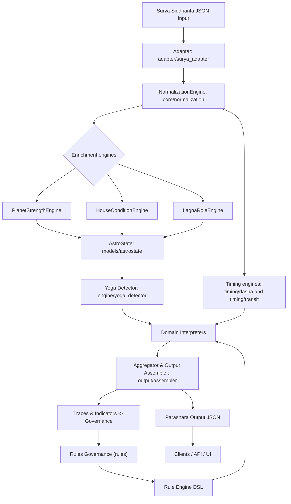

# Basic Specifications

## Purpose and scope

**Project name:** Jyothishyam Parāśara Engine

**Goal:** Consume Surya Siddhanta JSON and produce explainable Parāśara predictions for career, wealth, marriage, children, health, safety, yogas, dashas, and transits.

**Nonfunctional constraints:** Deterministic, auditable, versioned rules, no AGPL code reuse. Rules are data, rule-sets are versioned, and every prediction is explainable with evidence and trace.

## High level architecture

- **Adapter** — `adapter/surya_adapter.*` : Surya Siddhanta JSON → canonical `Chart` model.
- **NormalizationEngine** — `core/normalization.*` : canonicalization, stable IDs, normalization metadata.
- **Enrichment engines** — `core/planet_strength.*`, `core/house_state.*`, `core/lagna_role.*` : compute dignity, shadbala, avasthas, functional roles.
- **AstroState** — `models/astrostate.*` : typed knowledge graph (nodes, edges, indices).
- **Rule Engine and DSL** — `rules/dsl/spec.md`, `engine/rule_engine.*` : parse, compile, evaluate rules; produce evidence and trace.
- **Timing engines** — `timing/dasha.*`, `timing/transit.*`, `timing/fusion.*` : DashaContext, TransitContext, TimingInfluence.
- **Yoga Detector** — `engine/yoga_detector.*` : declarative yoga detection via Rule Engine.
- **Domain interpreters** — `interpreters/career.*`, `interpreters/wealth.*`, etc. : pluggable strategy classes.
- **Aggregator and Output Assembler** — `output/assembler.*` : build final JSON with metadata and explainability.
- **Governance** — `rules/` : versioned rule-sets, lifecycle metadata, audit logs.

## Input schema summary

Place canonical Surya Siddhanta JSON schema at `schemas/surya_input.schema.json`. Required top-level fields:

- `metadata` with `birth_datetime_utc`, `birth_location` ({latitude, longitude, timezone_offset_minutes}), `ayanamsa`, `house_system`, `sidereal`, `ephemeris_source`.
- `lagna` with `sign` and `degree` (decimal degrees: 0.0–30.0 within sign).
- `planets` array; each planet object must include:
  - `name` (string), `sign` (string), `degree` (number 0–30), `house` (1–12),
  - `nakshatra`: `{ name: string, pada: integer 1..4, index: integer }`,
  - `motion`: `{ retrograde: boolean }`,
  - `flags`: `{ combust: boolean, exalted: boolean, debilitated: boolean }`.
- `houses` array with `number` (1..12), `sign`, `cusp_degree`, `lord`.
- `aspects` array of `{ from: planet, to: planet, type: string, orb_degrees: number }`.
- `vargas` object optional (e.g., `D9`, `D10`) with per‑varga planet placements.
- `current_transits` with `datetime_utc` and `planets` positions similar to natal `planets` objects.

Example fixture: `fixtures/golden_chart_01.json`.

## Output schema summary

Place canonical Parāśara output schema at `schemas/parashara_output.schema.json`. Top-level sections:

- `engine` metadata: `name`, `engine_version`, `rule_set_family`, `rule_set_version`.
- `diagnostics`: `lagna_summary`, `planet_strengths`, `yogas` with evidence and trace references.
- `domains`: per-domain objects (`career`, `wealth`, `marriage`, `children`, `health`, `safety`) with `summary`, `score`, `confidence`, `components`, `indicators`.
- `dasha_timeline`: Vimshottari mahadashas and antardashas with domain highlights.
- `transits`: reference datetime and transit effects.
- `explainability`: `indicators_legend`, `scoring_formula`, `conflict_resolution_policy`.
Include example `fixtures/output_golden_chart_01.json`.

## AstroState typed graph schema summary

Place full schema at `schemas/astrostate.schema.json`. Core node types:

- `LagnaNode`, `PlanetNode`, `HouseNode`, `VargaNode`, `NakshatraNode`, `DashaNode`, `TransitNode`.
Core edge types:
- `ASPECTS`, `CONJUNCTION`, `EXCHANGE`, `OCCUPIES`.
Primary indices:
- `PlanetNode.name`, `HouseNode.number`, `NakshatraNode.index`, `VargaNode.type`.
Secondary indices:
- `PlanetNode.sign`, `PlanetNode.dignity_score`.
Canonical ID generation:
- `canonical_id = sha256(type + sorted(canonical_attributes_json))` where `canonical_attributes_json` is a compact JSON serialization with deterministic key order.
Graph invariants:
- Each `PlanetNode` has exactly one `OCCUPIES` edge to a `HouseNode`.
- Aspect relations are conceptually symmetric; store as directed edges for efficient traversal but ensure symmetric insertion (add both directions).
Deterministic accessors:
- Accessors must return deterministically ordered lists. Comparator rule: sort by `sign_index` (Aries=0..Pisces=11) then by `degree` ascending then by `canonical_id` lexicographic.

## DSL specification summary

Place full DSL spec at `rules/dsl/spec.md`. Include:

- AST JSON Schema and TypeScript types. AST node types: `PREDICATE`, `AND`, `OR`, `NOT`, `COUNT`, `ANY`, `ALL`, `EXISTS`, `DURING`, `TRANSIT_OVER`, `AT_INSTANT`, `MACRO_CALL`.
- Grammar: provide EBNF/PEG mapping from textual DSL to AST nodes; examples for predicate syntax and quantifiers.
- Primitives (with signatures):
  - `planet(name: string) -> PlanetNode` 
  - `house(n: int) -> HouseNode`
  - `lord(house: int) -> PlanetNode`
  - `in_sign(planet, sign: string) -> boolean`
  - `in_house(planet, house: int) -> boolean`
  - `degree_between(planet, a: float, b: float) -> boolean` (inclusive, modular 30°)
  - `is_exalted(planet) -> boolean`
  - `is_debilitated(planet) -> boolean`
  - `is_combust(planet) -> boolean`
  - `is_retrograde(planet) -> boolean`
  - `dignity_score(planet) -> float` (normalized 0..1)
- Graph ops: `aspects(a,b,type)`, `conjunct(a,b)`, `exchange(a,b)`, `kendra_from_lagna(x)`, `trikona_from_lagna(x)`.
- Aggregation primitives: `count(expr)`, `any(expr)`, `all(expr)`; quantifiers accept comparators (>=, <=, ==).
- Temporal ops: `during(dasha_lord)`, `transit_over(house, planet, period)`, `at_instant(evaluationInstant)`.
- Macro system: macro definition format, expansion semantics, hygiene rules. Constraints: max expansion depth = 8; macros cannot be recursive; compiler must detect cycles and reject definitions.
- Execution semantics: left-to-right short-circuit for `AND`/`OR`; memoize predicate evaluations per rule invocation; deterministic ordering of child evaluation; predicate errors evaluate as deterministic `false` and emit logged evidence; include cost estimates per predicate for optimizer.

## Rule format and lifecycle

Place at `rules/spec.md`. Rule fields:

- `id`, `version`, `status` (`draft`, `reviewed`, `validated`, `deprecated`, `archived`), `priority`, `base_score`, `domains`, `condition` (AST), `quality`, `created_by`, `reviewed_by`, `created_at_utc`, `reviewed_at_utc`.
Governance:
- SME approval tracking, diffs, rollback, environments (`development`, `staging`, `production`), audit logs.

## Timing model

Place at `timing/spec.md`. Key rules and precise defaults:

- Single `EvaluationInstant` frozen timestamp for entire pipeline. Rule: 
  - `EvaluationInstant = options.reference_datetime_utc if provided else now_utc()`
  - `evaluationInstant = floorToSlice(EvaluationInstant, slice_resolution_seconds)` where `floorToSlice(t,s)` returns `t` floored to the nearest lower multiple of `s` seconds since UNIX epoch.
- Default `slice_resolution_seconds = 60`.
- Boundary handling: if an event boundary equals the original request time, tie-breaker: prefer the new period (i.e., treat as entering the new period). For partial-slice blending, compute contribution proportionally to fraction of slice overlapped: `w = overlap_seconds / slice_resolution_seconds`.
- Dasha rules (Vimshottari): sequence and years: Ketu 7, Venus 20, Sun 6, Moon 10, Mars 7, Rahu 18, Jupiter 16, Saturn 19, Mercury 17. Start offset is `remaining_fraction = (nakshatra_end_degree - moon_degree_in_nakshatra) / nakshatra_span`; initial Mahadasha remaining years = `planet_dasha_years * remaining_fraction`.

## Conflict resolution and scoring

Place at `scoring/spec.md`. Formal algorithm with numeric defaults:

- Indicator attributes: `w_i` (signed base weight ∈ [-1,1]), `p_i` (priority integer), `q_i` (rule quality ∈ [0,1]), `e_i` (evidence strength ∈ [0,1]), `context` ∈ {`dasha`, `natal`, `transit`}.
- Context multipliers default: `m = { dasha: 1.2, natal: 1.0, transit: 0.6 }`.
- Contribution per indicator: `contrib_i = w_i * q_i * e_i * m[context_i]`.
- Raw aggregated score: `S_raw = Σ contrib_i`.
- Normalization: `S = σ(k * S_raw)` where `σ(x) = 1 / (1 + exp(-x))`. Default `k = 1.5`.
- Confidence formula: 
  - let `W_abs = Σ |w_i| * q_i * e_i` and `W_sum = Σ |w_i|` (if `W_sum == 0` treat ratio as 0).
  - cross-context agreement metric `A` ∈ [0,1] computed as weighted agreement across contexts (implementation detail in `scoring/spec.md`).
  - historical accuracy weight `H` ∈ [0,1] from backtesting.
  - `C = clamp( α * (W_abs / W_sum) + β * A + γ * H, 0, 1 )` with defaults `α=0.6, β=0.3, γ=0.1`.
- Equal-strength collapse rule: compute `sum_pos = Σ contrib_i for contrib_i>0`, `sum_neg = Σ contrib_i for contrib_i<0` (absolute). If `|sum_pos - sum_neg| <= epsilon` with default `epsilon = 0.05`, then return `score = σ(k * S_raw)` and set `confidence = min(confidence, 0.25)`; populate `conflicts[]` with full indicator traces.

## Performance and caching

Place detailed policy at `perf/spec.md`. Key items:

- AstroState cache key: `sha256(input_json_normalized)` where `input_json_normalized` is compact canonical JSON (sorted keys, normalized number formats).
- Compiled plan cache key: `sha256(rule_set_version + '|' + rule_id + '|' + normalization_version)`.
- Precomputed indices: predicate index by predicate type; aspect adjacency lists per planet (both incoming and outgoing edges stored).
- Lazy evaluation: mark expensive computations (vargas, shadbala, full strength matrices) as lazy; compute-on-demand and memoize per `EvaluationInstant`.
- Parallel evaluation: run independent domain interpreters concurrently; ensure deterministic aggregator by merging interpreter outputs in fixed domain order.
- Profiling hooks: collect `predicate_cost_ms`, `memoization_hits`, `cache_hit_rate` per request; expose metrics for dashboards.

## Testing strategy

Place at `tests/README.md`. Include:

- Golden charts and snapshot tests per `engine_version` and `rule_set_version`.
- Unit tests for NormalizationEngine, DSL predicates, Rule Engine, DashaEngine.
- Rule tests: each rule has synthetic AstroState fixtures asserting `match`, `score`, and `evidence`.
- Backtesting harness to compute `historical_accuracy`.

## Repo layout suggestion

```
/docs
  basic-specs.md
  gaps-to-fill.md
/schemas
  surya_input.schema.json
  parashara_output.schema.json
  astrostate.schema.json
/rules
  parashara
    v1
      yogas.yaml
      planets.yaml
      macros.yaml
      README.md
/engine
  adapter/
  core/
  engine/
  interpreters/
  timing/
  output/
  tests/
fixtures/
  golden_chart_01.json
  output_golden_chart_01.json
```

## Sprint 0 plan (4 weeks)
Note: the original Sprint 0 plan is a rough guide; implementation has evolved into a phased plan captured in `implementation.md` and `roadmap.md`. Use those files for current phase/priority decisions.

### Implementation mapping (current)
The following table maps the spec sections to the repository's current files (update as implementation progresses):

- Spec: `core/normalization.*` → Actual: `systems/Parasara/engine/normalizer.py`
- Spec: `models/astrostate.*` → Actual: `systems/Parasara/engine/astrostate.py` (flat model) and `systems/Parasara/schemas/astrostate.schema.json` (graph schema stub)
- Spec: `core/planet_strength.*`, `core/house_state.*`, `core/lagna_role.*` → Actual: implemented partially under `systems/Parasara/engine/enrichments/` (varga mapping present)
- Spec: `engine/yoga_detector.*` → Actual: planned under `systems/Parasara/engine/` (not yet implemented)
- Spec: `output/assembler.*` → Actual: not yet implemented (Phase 6)

### Repo layout note
The suggested repo layout in this document is aspirational. The current repository uses `Documentation/` for human-facing docs and `systems/Parasara/` for implementation. Relevant folders to review:

- `systems/Parasara/engine/` — core engine code (adapter, normalizer, enrichments, interpreters)
- `systems/Parasara/schemas/` — JSON schemas (input, astrostate, output)
- `systems/Parasara/tests/` — unit and snapshot tests
- `systems/Parasara/tools/` — helper scripts (snapshot generator, validators)
- `systems/Parasara/Documentation/` — system-specific documentation

If you prefer the repo to match the spec layout exactly, I can propose a migration plan (move/alias modules and update imports).

## Workflow



Short caption: pipeline shows adapter → normalization → enrichment → yoga/timing → interpreters → aggregator, with rule‑engine and governance feedback.
